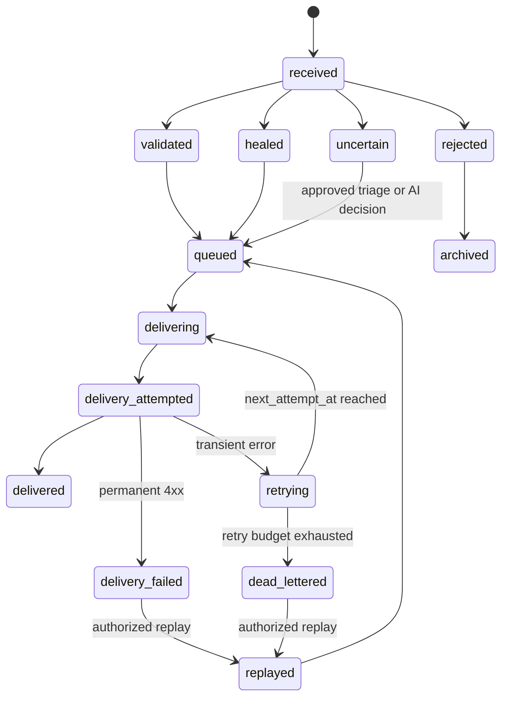
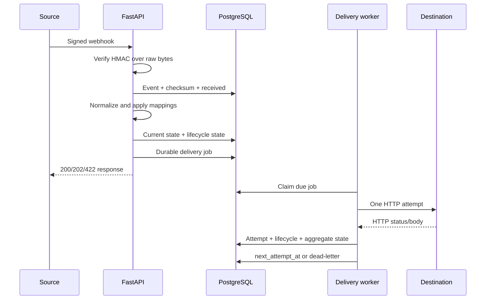
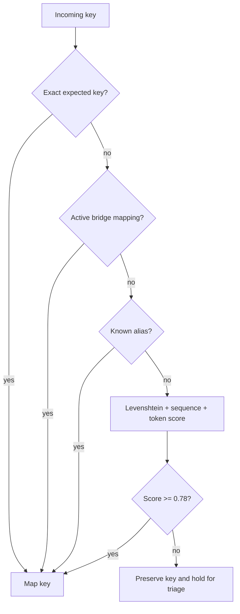
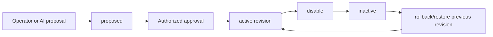

# HealPipe

HealPipe is a signed, multi-tenant webhook middleware platform that receives inconsistent source payloads, normalizes and maps them into a destination schema, pauses uncertain data for review, and delivers approved payloads to CRM or operational systems.

The platform is designed around durable evidence: every accepted event has persisted payload snapshots, mapping decisions, delivery attempts, retry outcomes, lifecycle transitions, and account ownership.

## Capabilities

- Per-bridge HMAC SHA-256 webhook verification.
- Per-bridge destination endpoint and signature secret.
- Payload normalization for whitespace, null-like values, booleans, integers, and decimals.
- Deterministic field aliases and similarity-based fuzzy matching.
- Bridge-owned versioned mapping rules with proposal, approval, disable, rollback, and dry-run testing.
- Conservative Claude-assisted resolution for uncertain fields.
- Durable delivery jobs and per-attempt delivery history.
- Retry policy for network errors, HTTP 408, 429, and 5xx responses.
- No retry for permanent 4xx responses.
- Exponential backoff: immediate, 1 minute, 5 minutes, 30 minutes, 2 hours.
- Dead-letter outcomes and operator notification.
- Manual single-event, batch, and time-range replay.
- Replay lineage and business idempotency protection.
- Immutable event lifecycle ledger and reconciliation counters.
- Exact inbound payload SHA-256 checksum.
- Four-stage audit inspector: inbound, normalized, healed/mapped, outbound.
- Payload diff, validation findings, AI telemetry, delivery responses, and retry history.
- Account ownership, API keys, scopes, roles, per-account isolation, and audit logs.
- JSON, CSV, summary, and PDF audit exports with sensitive-key redaction.
- React/Vite operations dashboard and bridge configuration UI.

## Architecture

```mermaid
flowchart LR
    Source[Source platform] -->|JSON + X-Webhook-Signature| Ingress[FastAPI signed ingress]
    Ingress --> Tenant[Resolve active bridge and account]
    Tenant --> Normalize[Normalize payload]
    Normalize --> Persist[Persist event evidence]
    Persist --> Mapping[Apply active mapping revision]
    Mapping --> Fuzzy[Alias and fuzzy matching]
    Fuzzy --> Validate{Validation state}
    Validate -->|validated/healed| Job[Create durable delivery job]
    Validate -->|rejected| Reject[Persist rejection and notify]
    Validate -->|uncertain| Triage[Pause for operator or Claude triage]
    Triage --> Job
    Job --> Queue[Durable job recovery + worker queue]
    Queue --> Retry[One outbound attempt]
    Retry --> CRM[CRM or destination endpoint]
    Retry --> Ledger[Attempt + lifecycle ledger]
    Retry --> Dead[Retrying or dead-lettered]
    Dead --> Replay[Authorized replay]
    Persist --> Audit[Audit API and exports]
    Ledger --> Audit
    Audit --> Dashboard[Operations dashboard]
```



## Event lifecycle

The current event projection stores the latest state. The immutable lifecycle ledger stores every transition.



## Webhook processing

1. The caller sends JSON to `/v1/webhooks/receive?bridge_id=<uuid>`.
2. HealPipe loads the active bridge and verifies the HMAC signature against the exact request bytes.
3. The raw body is hashed with SHA-256 before JSON transformation.
4. The event and `received` lifecycle transition are persisted transactionally.
5. Values are normalized recursively.
6. Active bridge mapping revisions are applied. Legacy mappings are used only as compatibility fallback.
7. Aliases and similarity matching map confident fields.
8. Missing required identity fields produce `rejected`.
9. Low-confidence fields produce `uncertain` and are held for triage.
10. Validated or healed payloads create a durable delivery job before queueing.
11. The worker performs one HTTP attempt and records its response.
12. The job is delivered, scheduled for retry, or dead-lettered.



## Normalization and mapping algorithms

### Value normalization

`normalize_payload()` recursively traverses dictionaries and lists. It converts:

- Empty strings and `null`-like strings to `None`.
- `true` and `false` strings to booleans.
- Integer-looking strings to integers.
- Decimal-looking strings to floats.
- All other strings are trimmed but preserved.

### Field matching

The deterministic mapper evaluates fields in this order:

1. Exact field match.
2. Bridge-owned active mapping revision.
3. Known alias match, such as `client_num -> customer_id`.
4. Maximum similarity across Levenshtein ratio, `SequenceMatcher`, and shared-token score.
5. Match accepted only when the score meets `DEFAULT_MATCH_THRESHOLD` (`0.78`).
6. Duplicate destination assignments are not overwritten.
7. Uncertain keys remain in the payload and are held for triage.



Claude is fail-closed. It can propose a destination only from the allowlist and only high-confidence decisions are forwarded automatically. Invalid Claude output or low confidence leaves the event held.

## Versioned mappings

Mapping revisions are immutable records scoped to both account and bridge.

```text
mapping_rules
-------------
mapping_id
account_id
bridge_id
source_field
destination_field
revision
status: proposed | approved | active | inactive | rejected
created_by
created_at
approved_by
approved_at
deactivated_by
deactivated_at
reason
```

Production mapping flow:



Available mapping endpoints:

```text
GET  /v1/bridges/{bridge_id}/mappings
POST /v1/bridges/{bridge_id}/mappings
POST /v1/mappings/{mapping_id}/approve
POST /v1/mappings/{mapping_id}/disable
POST /v1/mappings/{mapping_id}/rollback
POST /v1/bridges/{bridge_id}/mappings/test
```

Events store the mapping revision snapshot used for processing. Historical events therefore remain explainable after a rollback.

## Delivery and retry policy

A delivery job is persisted before it enters the process-local worker queue. The worker performs one request per invocation. Retry scheduling is stored in PostgreSQL through `next_attempt_at`; worker threads do not sleep for long backoff periods.

Retryable conditions:

- Network and timeout errors.
- HTTP 408.
- HTTP 429.
- HTTP 5xx.

Permanent conditions:

- Most HTTP 4xx responses, including 400, 401, 403, 404, and 422.

Default schedule:

```text
Attempt 1: immediate
Attempt 2: after 1 minute
Attempt 3: after 5 minutes
Attempt 4: after 30 minutes
Attempt 5: after 2 hours
Then: dead_lettered
```

The schedule can be configured with:

```text
DELIVERY_RETRY_BACKOFF_SECONDS=0,60,300,1800,7200
```

Each attempt stores status, HTTP status, bounded response body, error text, timestamps, and attempt number. Dead-letter transitions update the event projection, create lifecycle evidence, and send an operator notification.

## Replay and idempotency

Single replay:

```text
POST /v1/delivery-jobs/{job_id}/replay
```

Batch/time-range replay:

```text
POST /v1/delivery-jobs/replay-batch
```

Batch replay supports:

- Bridge scope.
- Status selection.
- Date range.
- Optional payload override.
- Optional destination URL override.
- Per-item queued/skipped results.
- Replay lineage.
- Lifecycle audit.

Replay preserves the original business idempotency key. The database claim is reusable for the same source event, while a different event with the same key remains blocked.

For production, require source idempotency keys:

```text
REQUIRE_IDEMPOTENCY_KEY=true
```

Claims are scoped by bridge and business key and include expiry. The original event, delivery job, attempt count, final state, and replay count remain auditable.

## Multi-tenant security

Every tenant-sensitive object carries `account_id`, including bridges, events, delivery jobs, mapping rules, idempotency claims, digest runs, lifecycle entries, exports, and audit records.

Authentication options:

- Per-bridge HMAC secrets for webhook ingress.
- Hashed account API keys for management and reporting APIs.
- API-key scopes.
- API-key roles: `owner`, `admin`, `operator`, `viewer`.

Sensitive operations require both role and scope compatibility. Examples:

```text
bridges:write       owner/admin
mappings:approve    owner/admin
mappings:write      owner/admin/operator
deliveries:replay   owner/admin/operator
 audit:export       owner/admin/operator
```

Database repositories apply account predicates. Cross-account object access returns not-found behavior rather than leaking object existence.

## Audit inspection

The audit API is:

```text
GET /v1/webhooks/events/{event_id}/audit?bridge_id=<uuid>
```

It returns:

- Raw inbound payload.
- Normalized payload.
- Healed/mapped payload.
- Exact outbound delivery-job payloads.
- Mapping changes and revision IDs.
- AI confidence telemetry.
- Validation findings.
- Delivery jobs.
- Delivery attempts and bounded responses.
- Retry count, final status, and timestamps.
- Raw request checksum.

The dashboard displays inbound, normalized, healed, and outbound payloads side by side, with changed paths highlighted.

## Reconciliation and data-loss evidence

The reconciliation endpoint is:

```text
GET /v1/webhooks/reconciliation?bridge_id=<uuid>
```

It returns account- and bridge-scoped counters:

```text
received_count
delivered_count
failed_count
pending_count
dead_letter_count
unaccounted_count
```

The authoritative evidence is the immutable lifecycle ledger. Current-state event and delivery-job columns are projections optimized for operational queries.

## Audit exports

Export endpoint:

```text
POST /v1/audit-exports
```

Supported formats:

- `json`: canonical technical evidence.
- `csv`: operations-friendly table.
- `summary`: compact client report data.
- `pdf`: client-facing summary report.

Filters:

- Account, derived from API key.
- Bridge.
- Event ID.
- Status.
- Source platform.
- Date range.

Exports include event identity, timestamp, source, raw checksum, final payload, mapping changes, validation findings, delivery jobs, attempts, and final result. Sensitive keys such as passwords, tokens, API keys, authorization headers, signatures, credentials, and secrets are redacted.

Every export records its filter set, row count, file checksum, requesting actor, and format in `audit_exports` and `audit_logs`.

## API overview

### Ingress and health

```text
POST /v1/webhooks/receive?bridge_id=<uuid>
GET  /health
```

### Events and audit

```text
GET /v1/webhooks/events
GET /v1/webhooks/stats
GET /v1/webhooks/reconciliation
GET /v1/webhooks/events/{event_id}/audit
```

### Bridges

```text
GET    /v1/bridges
POST   /v1/bridges
PATCH  /v1/bridges/{bridge_id}
DELETE /v1/bridges/{bridge_id}
```

### Accounts and API keys

```text
POST /v1/accounts
POST /v1/accounts/{account_id}/api-keys
```

API keys are returned once at creation time and stored only as hashes.

## Frontend

The React/Vite dashboard contains:

- Pipeline telemetry and bridge-scoped event streams.
- Status counters for validated, healed, rejected, uncertain, failed, dropped, and duplicate-blocked events.
- Payload inspector and diff view.
- Validation and AI telemetry display.
- Delivery ledger and replay control.
- Bridge registry.
- Versioned mapping proposal, approval, disable, rollback, and dry-run controls.

Start the frontend:

```powershell
npm install
npm run dev
```

The frontend normally runs at `http://localhost:5173`.

### Google-only login

The dashboard uses Google Identity Services. Google login is verified by the backend; the browser never sends a Google access token directly to application APIs.

1. In Google Cloud Console, create or select a project and configure the OAuth consent screen.
2. Create an OAuth client ID with application type `Web application`.
3. Add `http://localhost:5173` and `http://127.0.0.1:5173` to **Authorized JavaScript origins**. Google Identity Services uses the browser origin; no OAuth redirect URI is required for this button flow.
4. Add the client ID to both environments:

```text
# Backend .env
GOOGLE_CLIENT_ID=your-client-id.apps.googleusercontent.com
AUTH_SESSION_SECRET=generate-a-long-random-secret
AUTH_SESSION_TTL_SECONDS=28800

# Frontend .env.local
VITE_GOOGLE_CLIENT_ID=your-client-id.apps.googleusercontent.com
VITE_API_BASE_URL=http://127.0.0.1:8000
```

5. Install the backend requirements and initialize the schema. The `google_identities` table is created automatically.

Each first-time Google user receives a private HealPipe account and owner membership. Later sign-ins reopen the same account using Google's stable subject ID. Keep `AUTH_SESSION_SECRET` private and use a different value in each deployment.

For production, add the real dashboard domain to Authorized JavaScript origins and `CORS_ORIGINS`, serve both dashboard and API over HTTPS, and set `ACCOUNT_AUTH_REQUIRED=true`.

## Backend setup

For the free pilot and production migration procedure, see [DEPLOYMENT.md](DEPLOYMENT.md).

Create and activate the virtual environment:

```powershell
python -m venv .venv
.\.venv\Scripts\Activate.ps1
pip install -r requirements.txt
```

Configure PostgreSQL/Supabase and secrets in `.env`, then initialize the schema:

```powershell
.\.venv\Scripts\python.exe -m database.init_db
```

Start the API:

```powershell
.\.venv\Scripts\python.exe -m uvicorn main:app --host 127.0.0.1 --port 8000 --reload
```

The backend normally runs at `http://127.0.0.1:8000`.

Run the regression suite:

```powershell
.\.venv\Scripts\python.exe test_pipeline.py
```

Build the frontend:

```powershell
npm run build
```

## Configuration

Important settings:

```text
DATABASE_URL
DB_POOL_SIZE
DB_MAX_OVERFLOW
CORS_ORIGINS
HEALPIPE_PROCESS_ROLE
DELIVERY_WORKER_COUNT
WORKER_POLL_INTERVAL_SECONDS
ANTHROPIC_API_KEY
ANTHROPIC_MODEL
OPERATOR_API_KEY
ACCOUNT_AUTH_REQUIRED
REQUIRE_IDEMPOTENCY_KEY
DELIVERY_RETRY_BACKOFF_SECONDS
AUDIT_EXPORT_MAX_ROWS
SMTP_HOST
SMTP_PORT
SMTP_USERNAME
SMTP_PASSWORD
SMTP_START_TLS
ALERT_FROM_EMAIL
ALERT_TO_EMAIL
HEALPIPE_DASHBOARD_URL
```

## Operational limitations and production requirements

- PostgreSQL Row-Level Security policies are not created by the application migration and should be added for Supabase production deployments.
- The worker queue is process-local, but durable jobs and recovery scheduling survive process restarts.
- Large exports should move to asynchronous object-storage jobs with expiring download URLs.
- PDF export requires ReportLab.
- SMTP alerts are skipped when SMTP configuration is incomplete.
- Secrets in local `.env` files must never be committed. Rotate any credentials that have been exposed.
- Use a real identity provider or gateway-issued API keys for production account/member administration; the local operator bootstrap is intended for controlled setup.

## Design principles

1. Persist before enqueueing.
2. Verify signatures over raw bytes.
3. Preserve original evidence and never rewrite history.
4. Keep mapping revisions immutable.
5. Treat uncertain data as a safety hold.
6. Make retries durable and observable.
7. Scope every query by account ownership.
8. Redact credentials from exports and logs.
9. Prefer explicit failure over silent data loss.
10. Make every operational claim reconstructable from PostgreSQL evidence.
